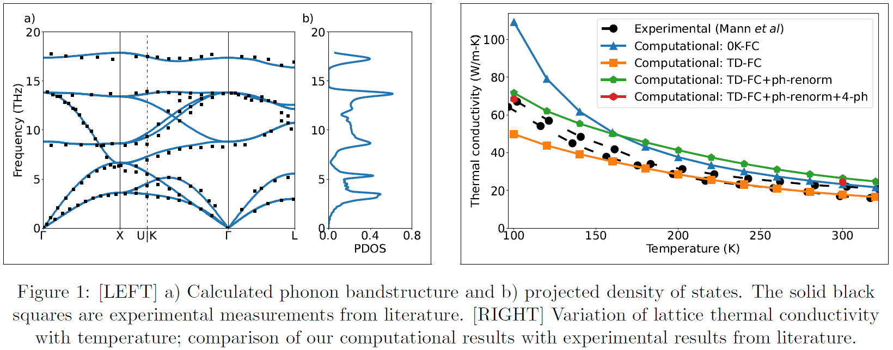

## First-principles Study on Phonon-mediated Thermal Energy Transport in ThO2
### 1. [Considerations for ab-initio based thermal conductivity prediction of ThO2](https://ishmtdigitallibrary.com/conferences/1654896405e56590,4869f8107409fb40,0a91fd4e3534321c.html)
<h1>Actinide oxides like uranium dioxide and mixed oxides are the primary fuel materials used in nuclear reactors around the globe. Thorium dioxide (ThO2) is a promising material from the actinide oxide family, that can be considered as an alternative to replace the aforementioned nuclear fuels. Understanding the thermal energy transport in nuclear fuel materials is crucial, as it directly impacts the safety and efficiency of nuclear reactors. In this work, ab-initio calculations are used to determine the lattice thermal conductivity of ThO2 at different temperatures. Density functional perturbation theory (DFPT) and density functional theory (DFT), along with lattice dynamics calculations are used to predict the harmonic and anharmonic phonon properties of ThO2, which are then used to calculate the lattice thermal conductivity of the material. The results from ab-initio calculations are compared with experimentally reported values and are in good agreement. The effect of temperature-dependent inter-atomic force constants (IFC) on the predicted thermal conductivity is investigated. It is found that these temperature-dependent IFCs affect the accuracy of predicted thermal conductivity for ThO2 crystals.</h1>

[Click here to read the full paper](IHMTC_2023_final.pdf)

  

[Take me back to Home page](./)
