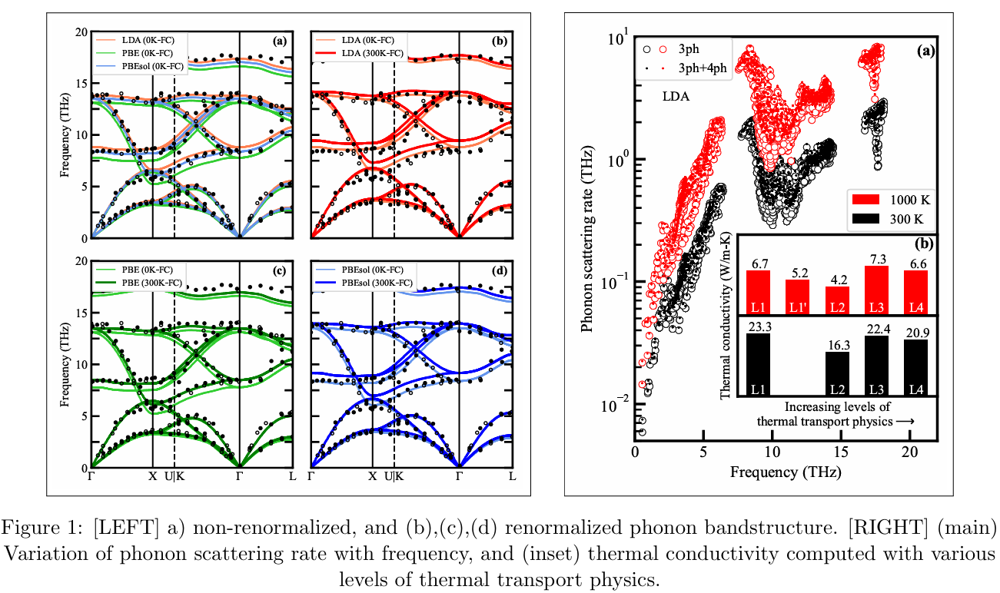

<link rel="stylesheet" href="/assets/css/custom.css">

<h2 style="text-align: center;"> Atomistic Simulations for Studying Phonon-mediated Thermal Energy Transport in Materials</h2> 
My research work focuses on using atomistic simulations (lattice dynamics, molecular dynamics) to study and understand the phonon-mediated thermal energy transport in materials for energy applications. Phonons, which are the quantized lattice vibrations, are the predominant heat energy carriers in non-metallic crystalline materials. A detailed review of the theory and advancements in the lattice-dynamics method for the calculation of thermal conductivity is given in the following article.

[Article submitted for review; link will be updated later](./research.md)

   
  <em>Figure: Diatomic chain (source: https://en.wikipedia.org/wiki/Phonon)</em>

<h2 style="text-align: center;">Studying Phonon-mediated Thermal Energy Transport in ThO2 Using Atomistic Simulations</h2> 

### 1. [Considerations for ab-initio based thermal conductivity prediction of ThO2](https://ishmtdigitallibrary.com/conferences/1654896405e56590,4869f8107409fb40,0a91fd4e3534321c.html)
Actinide oxides like uranium dioxide and mixed oxides are the primary fuel materials used in nuclear reactors around the globe. Thorium dioxide (ThO2) is a promising material from the actinide oxide family that can be considered as an alternative to replace the aforementioned nuclear fuels. Understanding the thermal energy transport in nuclear fuel materials is crucial, as it directly impacts the safety and efficiency of nuclear reactors. In this work, ab initio calculations are used to determine the lattice thermal conductivity of ThO2 at different temperatures. Density functional perturbation theory (DFPT) and density functional theory (DFT), along with lattice dynamics calculations, are used to predict the harmonic and anharmonic phonon properties of ThO2, which are then used to calculate the lattice thermal conductivity of the material. The results from ab initio calculations are compared with experimentally reported values and are in good agreement. The effect of temperature-dependent inter-atomic force constants (IFC) on the predicted thermal conductivity is investigated. It is found that these temperature-dependent IFCs affect the accuracy of predicted thermal conductivity for ThO2 crystals.

[Click here to read the full paper](IHMTC_2023_final.pdf)

  

### 2. [Revisiting thermal transport in ThO2 using higher-order thermal transport physics](https://doi.org/10.1016/j.commatsci.2025.113882)
The effect of inclusion of higher-order thermal transport physics (viz. temperature-dependent interatomic force constants, phonon renormalization, and four-phonon scattering) on the computation of phonon frequencies and lattice thermal conductivity of ThO2 is explored, employing LDA, PBE, and PBEsol exchange–correlation functionals. Upon renormalization, the frequencies are stiffened for the optical phonon modes, whereas the acoustic modes remain unchanged. Thermal conductivity computed using LDA and PBEsol functionals is within 5% of the experimentally measured values at 300 K, whereas that obtained using PBE functional results in an underprediction of 25%. The temperature-dependent force constants and renormalized phonon frequencies significantly affect the computed lattice thermal conductivity at higher temperatures (40% difference at 1000 K), whereas four-phonon processes have minimal effects (only 10% at 1000 K).

[Click here to read the full paper](CompMatSci_2025.pdf)

  

### 3. [Studying the effect of defects on the thermal energy transport in ThO2](./research.md) 
*research work in progress; content will be updated later*

### 4. [Studying the guest rotational dynamics and their effect on thermal transport in MAPbI3](./research.md)
*research work in progress; content will be updated later*

[Take me back to Home page](./)
